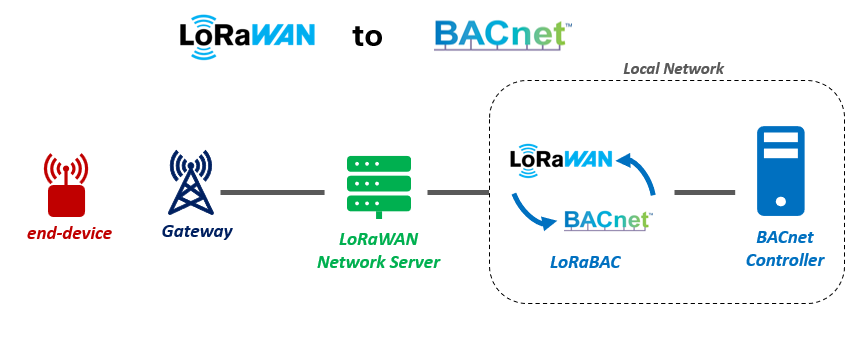

# LoRaBAC, an open-source LoRaWAN to BACnet interface
LoRaBAC is a **Node-RED-based application** that acts as a bridge between **LoRaWAN end-devices** and **BACnet controllers**. It enables a seamless communication between these two systems, supporting both **uplink** (from LoRaWAN to BACnet) and **downlink** (from BACnet to LoRaWAN).

Current version : v1.1.0

- [LoRaBAC, an open-source LoRaWAN to BACnet interface](#lorabac-an-open-source-lorawan-to-bacnet-interface)
  - [**1. Overview**](#1-overview)
    - [**1.1. What is LoRaBAC?**](#11-what-is-lorabac)
      - [**Key Features:**](#key-features)
    - [**1.2. What Makes LoRaBAC Unique?**](#12-what-makes-lorabac-unique)
      - [**Drawbacks:**](#drawbacks)
    - [**1.3. Support**](#13-support)
  - [**2. Prerequisites**](#2-prerequisites)
    - [**2.1. LoRaWAN End-Device**](#21-lorawan-end-device)
    - [**2.2. MQTT Broker**](#22-mqtt-broker)
    - [**2.3. Node-RED Setup**](#23-node-red-setup)
      - [**Required Node-RED Packages:**](#required-node-red-packages)
      - [**Additional Packages for ChirpStackV4:**](#additional-packages-for-chirpstackv4)
      - [**Quick Start with Docker:**](#quick-start-with-docker)
  - [**3. Getting Started**](#3-getting-started)
    - [**3.1. LoRaWAN Network Server configuration**](#31-lorawan-network-server-configuration)
    - [**3.2 LoRaBAC configuration for uplink**](#32-lorabac-configuration-for-uplink)
    - [**3.3. LoRaWAN payload and BACnet instance number**](#33-lorawan-payload-and-bacnet-instance-number)
    - [**3.4. LoRaBAC configuration for downlink**](#34-lorabac-configuration-for-downlink)
  - [**4. The device list**](#4-the-device-list)
    - [**4.1. Introduction**](#41-introduction)
    - [**4.2. Device type description**](#42-device-type-description)
      - [**Details of the `controller` property:**](#details-of-the-controller-property)
      - [**Details of the `lorawan` property:**](#details-of-the-lorawan-property)
      - [**Details of the `bacnet` property:**](#details-of-the-bacnet-property)
    - [**4.3. Specific information about the Network Server**](#43-specific-information-about-the-network-server)
    - [**4.4. BACnet object description**](#44-bacnet-object-description)
    - [**4.5. Examples**](#45-examples)
      - [**First example**:](#first-example)
      - [**Second example**:](#second-example)
  - [**5. Downlink strategies**](#5-downlink-strategies)
    - [**5.1. Overview of the Downlink Strategy**](#51-overview-of-the-downlink-strategy)
    - [**5.2. Steps to Add a New Downlink Strategy**](#52-steps-to-add-a-new-downlink-strategy)

## **1. Overview**
### **1.1. What is LoRaBAC?**
LoRaBAC is open-source application built on **Node-RED**. It allows you to integrate LoRaWAN devices with BACnet controllers, making it ideal for **smart building applications**.


#### **Key Features:**
- **Universal Compatibility:**
  - [x] Works with **all LoRaWAN end-devices** and **gateways**.
  - [x] Supports **ChirpStack**, **Actility**, and **The Things Stack** (The Things Network / The Things Industries) Network Servers.
  - [x] Integrates with **all BACnet controllers** using native BACnet protocols (or **Distech-Controls controllers** when using API Rest).

- **Bidirectional Communication:**
  - [x] **Uplink:** Writes LoRaWAN payloads to specific BACnet objects.
  - [x] **Downlink:** Reads BACnet objects and sends data to LoRaWAN devices.

- **Proven Use Cases:**
  - [x] Thermostatic valves
  - [x] Temperature and humidity sensors
  - [x] Air quality sensors
  - [x] Current monitoring sensors
  - [x] Pilot wired electric heater controller


### **1.2. What Makes LoRaBAC Unique?**
LoRaBAC is designed with a **different approach** compared to other LoRaWAN-BACnet interfaces. Here’s why it stands out:

**Advantages** :

1. **BACnet Client Architecture:**
   - Unlike most interfaces that act as **BACnet servers**, LoRaBAC operates as a **BACnet client**. It only interacts with the controller when a LoRaWAN payload is received, reducing unnecessary traffic.

2. **Flexible Deployment:**
   - LoRaBAC can be installed **anywhere**:
     - On the **LoRaWAN Gateway**.
     - Within the **local network**.
     - Directly on the **BACnet controller**.

3. **Open Source and Free:**
   - LoRaBAC is **free to use** and **open-source** under the **MIT License**, offering full transparency and customization.

#### **Drawbacks:**
1. **No "Who-is" Service Support:**
   - LoRaBAC does not respond to the **"Who-is" service**, which can be useful for discovering BACnet devices in some setups.

2. **Manual Configuration Required:**
   - Each new LoRaWAN device type requires **manual configuration**. It is not a "Plug and Play" solution.

### **1.3. Support**
To get support on LoRaWAN or LoRaBAC, please refers to the followings ressources, or [reach us](https://www.univ-smb.fr/lorawan/en/contact/) out.

:tv: Webinar Replay: [LoRaWAN and BACnet interfaces for Smart Building]()

:notebook: Free ebook:[LoRaWAN for beginers books](https://www.univ-smb.fr/lorawan/en/free-book/)

:tv: E-learning platform: [LoRaWAN for beginers videos](https://www.udemy.com/course/lora-lorawan-internet-of-things/?referralCode=21DED0F1021F4E261955)

:tv: E-learning platform for Advanced users: [LoRaWAN for Advanced users videos](https://www.udemy.com/course/lorawan-for-advanced-users/?referralCode=BA4A670560916E1AED77)

:bulb: 2 days training sessions: [LoRaWAN and IoT Training](https://www.univ-smb.fr/lorawan/avada_portfolio/formation-distanciel/)

## **2. Prerequisites**

### **2.1. LoRaWAN End-Device**
To use LoRaBAC, ensure your LoRaWAN devices are:
- Provisioned on a **Network Server**.
- Configured with a **payload decoders** (for uplink).
- Configured with a **payload encoders** (for downlink, if needed).

Payload decoder and encoders should be provided by your device manufacturer.


### **2.2. MQTT Broker**
LoRaBAC relies on an **MQTT broker** for communication. You can use:
- The built-in MQTT broker provided by **ChirpStack**, **Actility**, or **The Things Stack**.
- Your own **custom MQTT broker**.


### **2.3. Node-RED Setup**
LoRaBAC is a **Node-RED flow**, so you need a **Node-RED instance** to run it. Ensure the following packages are installed:

#### **Required Node-RED Packages:**
- `node-red-contrib-bacnet` (for BACnet integration).

#### **Additional Packages for ChirpStackV4:**
If you’re using **ChirpStackV4** and want to enable the **"Flush Downlink Queue"** feature, install:
- `@grpc/grpc-js`
- `@chirpstack/chirpstack-api`

#### **Quick Start with Docker:**
A pre-configured **Node-RED Docker image** is available on [Docker Hub](https://hub.docker.com/r/montagny/node-red/tags). It includes all required packages for easy deployment.


## **3. Getting Started**

### **3.1. LoRaWAN Network Server configuration**
1. **Provision your end-device:**
    * Log in to your LoRaWAN Network Server (LNS)
    * Add a new end-device following the naming pattern `xxxxx-NUM` (e.g., mclimate-vicki-1, micropelt-mlr003-3...)
    * Configure the **payload decoder** for this end-device. If downlink is required, also configure the **payload encoder**.
2. **MQTT integration:**
    * Note down the MQTT broker address, login, password and topic.

### **3.2 LoRaBAC configuration for uplink**
1. **Import LoRaBAC:**
    * Open Node-RED and go to `Menu > Import`
    * Select the LoRaBAC.json file from the [GitHub repository](https://github.com/SylvainMontagny)
2. **Connect the MQTT client:**
    * In Node-RED, locate the MQTT client subscriber node (on the left).
    * Enter the MQTT broker details (broker address, login, password).
    * Set the topic to subscribe to (see the comment panel in your flow).
3. **Deploy and test:**
    * Click `Deploy` in Node-RED.
    * Check your MQTT subscriber (should be connected and green).

> :bulb: At this point, each time your LoRaWAN end-device sends an uplink, LoRaBAC should throw an error in the Debug window : **"This Device Type doesn't belong to the Device List"**. This is a normal behavior as the device list is still empty.


1. **Add your device to the device list:**
    * If you want to use the list of supported end-devices, copy the whole content of `configuration.js` file from the [GitHub repository](https://github.com/SylvainMontagny). Open the `TO CONFIGURE` node in the configuration group and paste the whole content to update the whole // TO CONFIGURE // section.
    * If your end-device is not natively supported by the solution, you need to follow the [Device List section](#4-the-device-list) to add a new end-device type in the device list.

2. **Adjust properties:**
    * Modify the properties in the `deviceList` JSON object to match your requirements.

> :bulb: **Second test**  
> At this point, each time your LoRaWAN end-device sends an uplink, LoRaBAC should write the LoRaWAN paylaod in the corresponding BACnet object in the controller. 


### **3.3. LoRaWAN payload and BACnet instance number**
The `number` in the end-device name determines the BACnet object instance number.

Example: For the device type `usmb-valve` with an `instanceRangeAV=10`, an `instanceRangeBV=5`, an `offsetAV=0` and `offsetBV=0`.

For **usmb-valve-1**:
- 1st `analog value` BACnet object will be written at instance **10**.
- 2de `analog value` BACnet object will be written at instance **11**.
- 3rd `analog value` BACnet object will be written at instance **13**.
- 1st `binary value` BACnet object will be written at instance **5**.
- 2de `binary value` BACnet object will be written at instance **6**.
- 3rd `binary value` BACnet object will be written at instance **7**.
- ...

For **usmb-valve-2**:
- 1st `analog value` BACnet object will be written at instance **20**.
- 2de `analog value` BACnet object will be written at instance **21**.
- 3rd `analog value` BACnet object will be written at instance **22**.
- 1st `binary value` BACnet object will be written at instance **10**.
- 2de `binary value` BACnet object will be written at instance **11**.
- 3rd `binary value` BACnet object will be written at instance **12**.
- ...

For **usmb-valve-51**:
- 1st `analog value` BACnet object will be written at instance **510**.
- 2de `analog value` BACnet object will be written at instance **511**.
- 3rd `analog value` BACnet object will be written at instance **512**.
- 1st `binary value` BACnet object will be written at instance **255**.
- 2de `binary value` BACnet object will be written at instance **256**.
- 3rd `binary value` BACnet object will be written at instance **257**.
- ...


### **3.4. LoRaBAC configuration for downlink**
1. **Connect the MQTT publisher:**
    *  Click `Deploy` in Node-RED.
    *  Locate the MQTT client publisher node in Node-RED (on the right).
    *  Select the MQTT broker.
    * /!\ **Do not set a topic**.
2. **Deploy and test**:
    * Check your MQTT publisher (should be `connected` and `green`).
4. **Add Downlink Section:**
   * In the `Downlink Strategies` node, add a new case in the switch-case statement for your downlink needs.


## **4. The device list**
 
### **4.1. Introduction**
The list of device supported is provided thanks to a JSON object called "deviceList" that contains an infinite number of devices types. For example, if your use case has 200 "thermostatic-valve" and 300 "temperature-sensor", then you need to configure 2 device types and the device list should look like as follows :

```javascript
let deviceList = {
    "thermostatic-valve": {
        // Description for all "thermostatic-valve"
    },
    
    "temperature-sensor": {
         // Description for all "temperature-sensor"
    }
}
```

LoRaBAC comes with the support of the following LoRaWAN device types :
```javascript
let deviceList = {
    "usmb-valve": {},           // Thermostatic valve simulator (useful to test LoRaBAC application).
    "dragino-lht65": {},        // Temperature and Humidity sensor.
    "watteco-tempo": {},        // Temperature and humidity sensor
    "atim-thaq": {},            // Temperature, humidity, CO2
    "elsys-ers2co2": {},        // Temperature, humidity, CO2
    "mclimate-vicki": {},       // Thermostatic valve
    "milesight-wt101": {},      // Thermostatic valve
    "micropelt-mlr003": {},     // Thermostatic valve
    "atim-egreen": {},          // Current sensor
    "milesight-ct103": {}       // Current sensor
}
```

Please, [reach us](https://www.univ-smb.fr/lorawan/en/contact/) out if you need us to configure LoRaBAC for your LoRaWAN end-device. 


### **4.2. Device type description**
Each device type in the deviceList is a JSON object with its complete configuration. Here are the properties that need to be completed.

| Property    | Type   | Description                                                   | Required |
|-------------|--------|---------------------------------------------------------------|----------|
| `controller`| Object | Information about the controller                              | Yes      |
| `lorawan`   | Object | Information about the LoRaWAN Network Server                  | Yes      |
| `bacnet`    | Object | Correspondence between LoRaWAN payload and BACnet object      | Yes      |

<br><br>

#### **Details of the `controller` property:**

The values in brackets [ ] are the available possibilities.

| Property   | Type   | Description                                                   | Required               |
|------------|--------|---------------------------------------------------------------|------------------------|
| `debug`    | String | Debug level: [null, "all", "forceOn", "up", "down", "creation", "txTime"] | No         |
| `model`    | String | Controller's model: ["distechControlsV2"]                     | Only if using RestAPI  |
| `protocol` | String | Type of protocol: ["restAPIBacnet", "bacnet"]                 | Yes                    |
| `ipAddress`| String | IP address of the controller: "X.Y.W.Z"                       | Yes                    |
| `login`    | String | Login of the controller                                       | Only if using RestAPI  |
| `password` | String | Password of the controller                                    | Only if using RestAPI  |

**Debug level:**
- **null**: No debug
- **"all"**: Most verbose level
- **"up"**: Debug the uplink part only
- **"down"**: Debug the downlink part only
- **"creation"**: Debug the BACnet object creation part only
- **"txTime"**: Debug the Transmission time part only
- **"forceOn"** : Used to force a debug function whatever the debug level
<br><br>

#### **Details of the `lorawan` property:**

| Property            | Description                                                                 | Required                       |
|---------------------|-----------------------------------------------------------------------------|--------------------------------|
| `networkServer`     | Network Server used: ["tts", "chirpstack", "actility"]                      | Yes                            |
| `downlinkPort`      | Downlink port used for downlink                                             | Only if using downlink         |
| `flushDownlinkQueue`| Enable "Flush Downlink Queue": [true, false]                                | Only if using downlink         |
| `chirpstack`        | [ChirpStack specific information](#43-specific-information-about-the-network-server) | Only if using ChirpStack AND Flush downlink Queue capability |
| `actility`          | [Actility specific information](#43-specific-information-about-the-network-server) | Only if using Actility AND downlink |
| `tts`               | [TTS specific information](#43-specific-information-about-the-network-server) | Only if using TTS              |

<br><br>


#### **Details of the `bacnet` property:**

| Property          | Type   | Description                                      | Required |
|-------------------|--------|--------------------------------------------------|----------|
| `offsetAV`        | Number | Beginning of analog values instance range        | Yes      |
| `offsetBV`        | Number | Beginning of binary values instance range        | Yes      |
| `instanceRangeAV` | Number | Number of analog value BACnet objects to store   | Yes      |
| `instanceRangeBV` | Number | Number of binary value BACnet objects to store   | Yes      |
| `objects`         | Object | [LoRaWAN payload and BACnet object correspondence](#44-bacnet-object-description) | Yes      |


### **4.3. Specific information about the Network Server**
Depending on the LoRaWAN Network Server, there might be some specific configuration. They are store within the following properties.

- Details for the `actility` property:
When using downlink, ThingPark needs information to retrieve the payload encoder. In ThingPark, the payload decoder are called drivers and have 3 identifiers : pID, mID and ver.

```json
"actility": {
    "driver": {
        "pId": "TO_CONFIGURE_IF_USING_ACTILITY_AND_DOWNLINK",
        "mId": "TO_CONFIGURE_IF_USING_ACTILITY_AND_DOWNLINK",
        "ver": "TO_CONFIGURE_IF_USING_ACTILITY_AND_DOWNLINK"
    }
}
```
- Details for the `chirpstack` property:
When using downlink as well as the "Flush Downlink Queue" capability, LoRaBAC uses the ChirpStack's grpc API to flush the queue. Therefore, we need to provide the API Key generated by ChirpStack.  
```javascript
"chirpstack": {
    "grpcApikey": chirpstackGrpcApikey
}
```
- Details for the `tts` property:
There is no use for the `tts`property yet. This is Reserved for Future.

### **4.4. BACnet object description**
The `objects` is a JSON object that describes the association between all LoRaWAN payload and its corresponding BACnet objects. The association is described as follows. All properties are required:
```javascript
"objects": {
    "BACNET_OBJECT_NAME_1": {       // String, name of the BACnet object to write in the controller
        "lorawanPayloadName": "LORAWAN_PAYLOAD_NAME", // String, name of the LoRaWAN paylaod as provided by the payload decoder
        "objectType": "OBJECT_TYPE",    // String, BACnet type: ["analogValue", "binaryValue"]
        "instanceNum": INSTANCE_NUM,    // Number, BACnet object instance number
        "dataDirection": "DIRECTION",   // String, Direction of the BACnet Object: ["uplink", "downlink"]
        "value": null                   // Number, LoRaWAN payload value <> BACnet object present value. 
        },
    "BACNET_OBJECT_NAME_2": {
        ...
    },
    ...
}
```


### **4.5. Examples**
#### **First example**: 
A `brand-sensor` LoRaWAN device that works with `any controller`s using native BACnet, `TTN`, 1 BACnet object, object instance for `analog values starts at 1000`, object instance for `binary values starts at 500`, `no downlink`.

```json
  "brand-sensor": {
        "controller": {
            "debug": ["all"],
            "interface": "bacnet",
            "ipAddress": "ipAddress",
        },
        "lorawan": {
            "networkServer": "tts",
        },
        "bacnet": {
            "offsetAV": 1000,
            "offsetBV": 500,
            "instanceRangeAV": 1,
            "instanceRangeBV": 0,
            "objects": {
                "temperature": { "lorawanPayloadName": "TempC", "objectType": "analogValue", "instanceNum": 0, "dataDirection": "uplink", "value": null },
            }
        }
    }
```

In this example, the LoRaWAN payload `TempC` will be written in an `analog value` BACnet object called `temperature` with the following instance numbers :
- `1001` for `brand-sensor-1`
- `1002` for `brand-sensor-2`
- `1003` for `brand-sensor-3`
- `offsetAV + (instanceRangeAV * x) + instanceNum` for `brand-sensor-x`. 

#### **Second example**:
A `brand-sensor` LoRaWAN device connected to a `Distech-Controls` controller using `Rest API`, `ChirpStack`, 3 BACnet objects (2 uplink and 1 downlink), object instance for `analog values starts at 0`, object instance for `binary values starts at 0`,, downlink port used is `30`.

```json
    "brand-sensor": {
        "controller": {
            "debug": ["all"],
            "model": "distechControlsV2",
            "interface": "restAPIBacnet",
            "ipAddress": "X.Y.W.Z",
            "login": "YOUR_LOGIN",
            "password": "YOUR_PASSWORD",
        },
        "lorawan": {
            "networkServer": "chirpstack",
            "downlinkPort": 30
        },
        "bacnet": {
            "offsetAV": 0,
            "offsetBV": 0,
            "instanceRangeAV": 3,
            "instanceRangeBV": 0,
            "objects": {
                "valveSetpoint": { "lorawanPayloadName": "setpoint", "objectType": "analogValue", "instanceNum": 0, "dataDirection": "uplink", "value": null },
                "valveTemperature": { "lorawanPayloadName": "temperature", "objectType": "analogValue", "instanceNum": 1, "dataDirection": "uplink", "value": null },
                "controllerSetpoint": { "lorawanPayloadName": "target-setpoint", "objectType": "analogValue", "instanceNum": 2, "dataDirection": "downlink", "value": 20 }
            }
        }
    }
```
In this example:
- The LoRaWAN payload `setpoint` will be **written** in an `analog value` BACnet object called `valveSetpoint`:
- The LoRaWAN payload `temperature` will be **written** in an `analog value` BACnet object called `valveTemperature`.
- The `analog value` of the BACnet object `controllerSetpoint` will be **written** in the LoRaWAN payload called `target-setpoint`.

The following instance number will be used for the BACnet object:

|                   | valveSetpoint   | valveTemperature | controllerSetpoint |
|-------------------|:---------------:|:----------------:|:------------------:|
| `brand-sensor-1`  |        3        |        4         |         5          |
| `brand-sensor-2`  |        6        |        7         |         8          |
| `brand-sensor-3`  |        9        |       10         |        11          |
| `brand-sensor-x`  |         offsetAV + (instanceRangeAV * x) + instanceNum |   offsetAV + (instanceRangeAV * x) + instanceNum  | offsetAV + (instanceRangeAV * x) + instanceNum  |    


## **5. Downlink strategies**
Interfacing uplink LoRaWAN payload with BACNet object is quite simple, however it's more challenging to send downlink from BACnet object to LoRaWAN end-device as we need to define a strategy. The strategy describes what downlink message should be sent from the BACnet object to the LoRaWAN end-device.

### **5.1. Overview of the Downlink Strategy**
The downlink strategy is device-specific. Right now, in the LoRaBAC application, the only LoRaWAN end-devices that use downlink are thermostatic valves so they all have the same strategy. For example, in the case of thermostatic valves:

* On each uplink, the valve's setpoint is compared to the controller's setpoint.
* If the values are different, the controller's setpoint is sent to the valve via a downlink message.
* If the values are the same, no action is taken.


This logic is implemented in the Downlink Configuration Node in Node-RED.

### **5.2. Steps to Add a New Downlink Strategy**

1. **Open the donwlink configuration node:**
    * Open LoRaBAC application.
    * Locate the `Downlink` group and open the node `TO CONFIGURE`.
2. **Add a new strategy:**
    * Add a new entry for your device type.
    * The policy must return the following javascript object or null if there is nothing to dowlink:
```javascript
return {
    payload: {
        "NAME_OF_THE_BACNET_OBJECT_TO_DOWNLINK": VALUE_OF_THE BACNET_OBJECT_TO_DOWNLINK
    },
    device: device
}
```